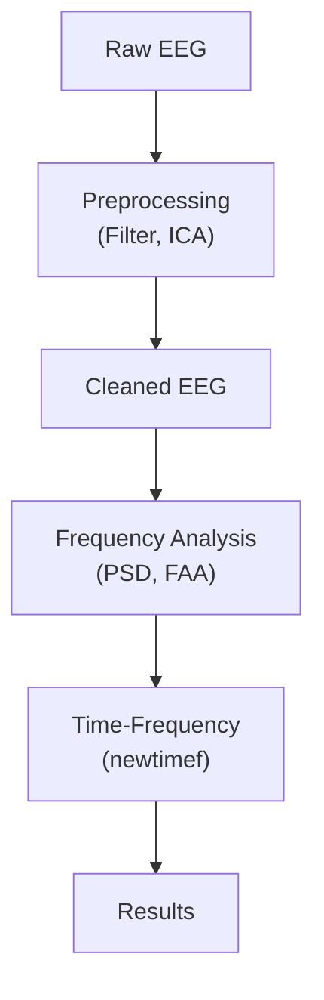
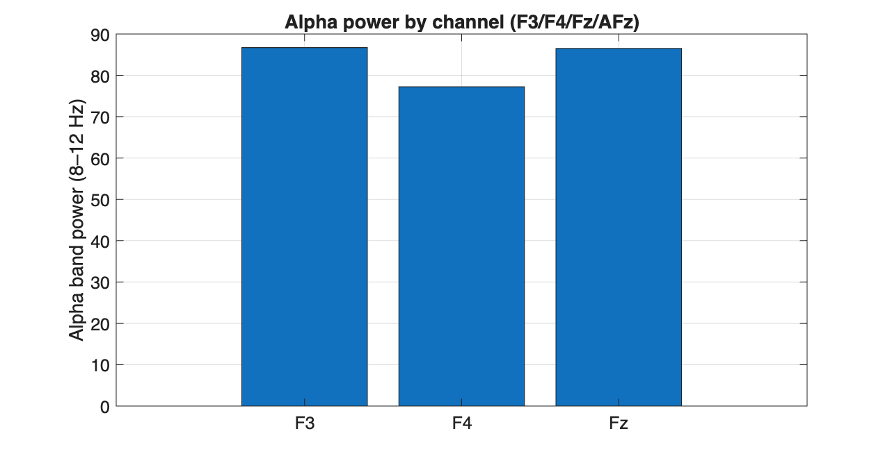
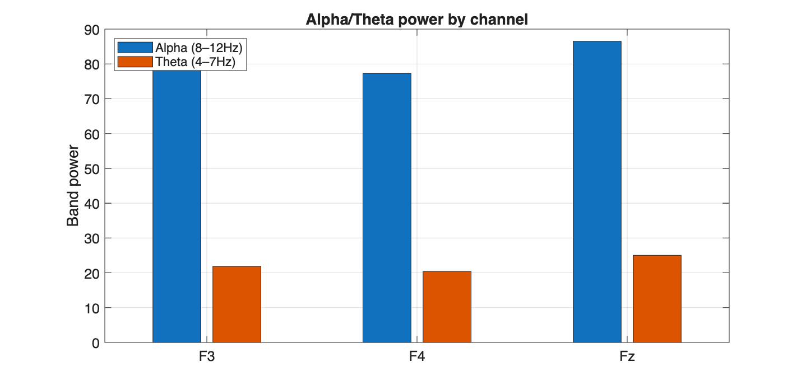
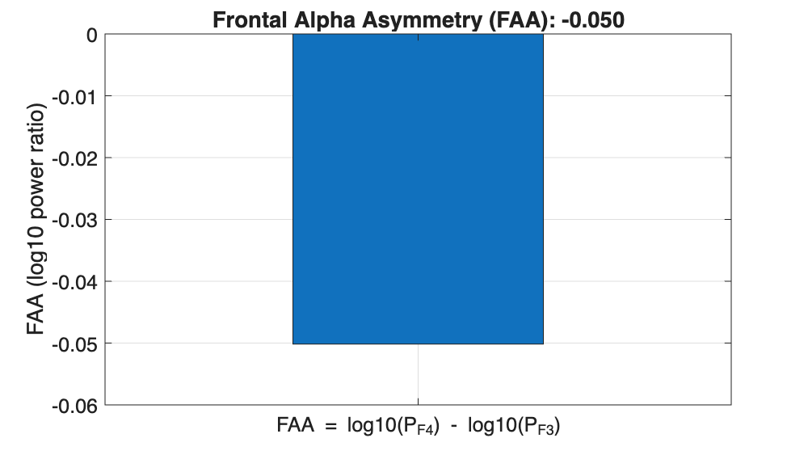
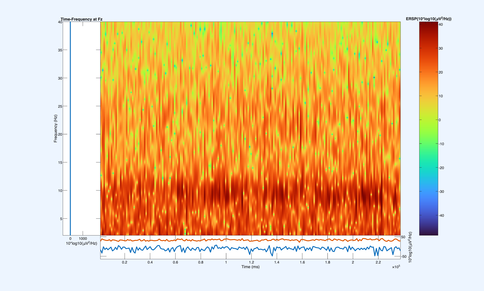

# mini-frontal-eeg

Mini project for frontal EEG analysis using MATLAB & EEGLAB.  
Focus: prefrontal alpha activity, ADHD-related motivation, and basic signal processing pipeline.

---

## ADHD and Prefrontal Alpha Activity

A common feature of ADHD is **insufficient activation of the prefrontal cortex**, especially during tasks that require sustained attention and executive control.

Some studies have found that individuals with ADHD may show **elevated alpha power** in the prefrontal regions, which reflects “too much idling” of the cortex. This may be linked to difficulties in attention regulation.

Therefore, many interventions (e.g., neurofeedback, medication, cognitive training) aim to help the prefrontal cortex **maintain low alpha power and stay active** during tasks.

### Relationship Between Alpha Power, Prefrontal Function, and ADHD

| Alpha Power Level | Prefrontal Functional State | ADHD Relevance |
| ----------------- | --------------------------- | -------------- |
| **High (↑)**      | Prefrontal cortex inhibited / under-activated (resting, distracted, mind-wandering) | May be related to inattention and deficits in executive control |
| **Low (↓)**       | Prefrontal cortex active (task execution, focus, working memory) | Typically associated with concentration and task engagement |

---

## FAA (Frontal Alpha Asymmetry)

- **Definition**: FAA is calculated as the difference in alpha power between the right and left frontal electrodes (commonly: `log10(Pα_F4) – log10(Pα_F3)`).

- **Interpretation**:  
  - **Left-active pattern** (lower alpha at F3): linked to approach motivation and positive affect.  
  - **Right-active pattern** (lower alpha at F4): linked to withdrawal tendencies and negative affect.  

- **Relevance to ADHD**: Abnormal FAA patterns have been reported in ADHD, suggesting imbalances in frontal regulatory networks related to emotion and attention.

---

## Repository Structure

```
mini-frontal-eeg/
├── data/
│   └── cleaned/
│       ├── sample_cleaned.set
│       └── sample_cleaned.fdt
├── figs/                      # will hold output figures
├── scripts/
│   ├── compute_bandpowers_eeglab.m
│   ├── frequency_domain_analysis.m
│   ├── hello_matlab.m
│   ├── pick_channels_by_labels_for_ffa.m
│   ├── preprocess.m
│   ├── psd_bandpower.m
│   └── timefreq.m
├── .gitignore
├── LICENSE
└── README.md


````

---

## Environment

- **MATLAB R2025a** (academic license)  
- **EEGLAB toolbox** (added to MATLAB path)  
- Git + GitHub (project version control)  

Recommended: run on macOS/Linux for stable EEGLAB support.

---

## How to Run

1. **Clone the repository**  
   ```
   git clone https://github.com/hortus-neu/mini-frontal-eeg.git
   cd('/Users/hetao/Projects/mini-frontal-eeg')
   ```
2. **Open MATLAB** and add `scripts/` to the path.
    ```
    addpath(genpath(pwd))
    ```

3. **Preprocessing**
    * Performs bandpass filter (1–40 Hz), notch filter, average reference, ICA artifact removal.
   * Saves cleaned `.set` files into `data/cleaned/`.
   ```
   >> preprocess
   ```
   
4. **Frequency-domain analysis**
   * Computes PSD, extracts alpha (8–12 Hz) power, and computes FAA.
   * Saves plots into `figs/psd.png` and `figs/faa.png`.

   ```matlab
   >> frequency_domain_analysis
   ```

5. **Time-frequency analysis**
   * Runs EEGLAB’s `newtimef` for Fz channel.
   * Saves figure into `figs/timefreq_Fz.png`.

   ```matlab
   >> timefreq_analysis
   ```
---
## Pipeline


---

## Results

### 1. Power Spectral Density (PSD)

**Figure:**


**Description:** Shows the overall spectral distribution of frontal channels (F3, F4, Fz).

**Observation:**

* Clear peaks in the **alpha band (8–12 Hz)** and **theta band (4–7 Hz)**.
* Pattern is consistent with typical EEG spectral profiles.


### 2. Alpha/Theta Band Power
**Figure:**


**Description:** Bar plot comparing alpha and theta power across F3, F4, and Fz channels.

**Observation:**

* Alpha power is **dominant** across all channels.
* Theta power is lower but still visible, especially at **midline (Fz)**.
* This alpha–theta balance is often studied in relation to **attention and working memory**.


### 3. Frontal Alpha Asymmetry (FAA)

**Figure:**


**Definition:** FAA = log10(Pα\_F4) – log10(Pα\_F3).

**Result:** FAA ≈ **–0.05**.

**Interpretation:**

* Slight **left-frontal dominance** (lower alpha on F3 than F4).
* Often linked to **approach motivation** and **positive affect**.


### 4. Time-Frequency Analysis at Fz

**Figure:**


**Description:** ERSP (Event-Related Spectral Perturbation) map for the Fz channel (2–40 Hz).

**Observation:**

* Strong, sustained **broadband activity** is visible (mostly positive power relative to baseline).
* Because baseline was set to **NaN** (whole trial), much of the map shows enhancement across frequencies.
* Next step: use a **pre-stimulus baseline window** (e.g., –200 to 0 ms) for clearer task-related effects.

👉 Together, these results confirm that the pipeline successfully extracts:

* **Spectral features** (PSD, alpha/theta)
* **Asymmetry metrics** (FAA)
* **Time-frequency dynamics** (ERSP at Fz)

This demonstrates the feasibility of using this **mini frontal EEG workflow** for cognitive neuroscience applications.


---
## Future Work

This mini project currently demonstrates a basic pipeline for frontal EEG analysis
(preprocessing, spectral features, FAA, and time–frequency visualization).
Future directions may include:

- **Larger Datasets**  
  Apply the pipeline to more participants or publicly available EEG datasets
  (e.g., ADHD vs. control groups) to validate robustness.

- **Condition Comparisons**  
  Extend beyond demo data to analyze task paradigms such as 0-back vs. 2-back,
  or eyes-open vs. eyes-closed, to explore task-related modulation of frontal alpha.

- **Enhanced Features**  
  Incorporate additional EEG markers (theta/beta ratio, connectivity metrics)
  alongside FAA to capture broader aspects of frontal function.

- **Automated Artifact Rejection**  
  Replace manual ICA component rejection with ICLabel or machine learning-based
  classification to improve reproducibility.

- **Clinical Relevance**  
  Investigate whether abnormal FAA or elevated frontal alpha can serve as
  biomarkers for ADHD assessment and monitor the effects of interventions
  (neurofeedback, medication, cognitive training).

- **Integration with Python**  
  Re-implement parts of the pipeline using MNE-Python for better compatibility
  with modern machine learning workflows.


---

## License
Academic / research use only.
