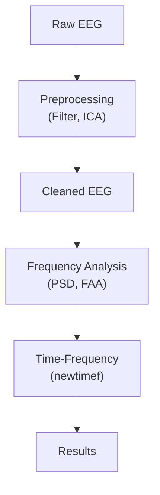

# mini-frontal-eeg

Mini project for frontal EEG analysis using MATLAB & EEGLAB.  
Focus: prefrontal alpha activity, ADHD-related motivation, and basic signal processing pipeline.

---

## ADHD and Prefrontal Alpha Activity

A common feature of ADHD is **insufficient activation of the prefrontal cortex**, especially during tasks that require sustained attention and executive control.

Some studies have found that individuals with ADHD may show **elevated alpha power** in the prefrontal regions, which reflects “too much idling” of the cortex. This may be linked to difficulties in attention regulation.

Therefore, many interventions (e.g., neurofeedback, medication, cognitive training) aim to help the prefrontal cortex **maintain low alpha power and stay active** during tasks.

### Relationship Between Alpha Power, Prefrontal Function, and ADHD

| Alpha Power Level | Prefrontal Functional State | ADHD Relevance |
| ----------------- | --------------------------- | -------------- |
| **High (↑)**      | Prefrontal cortex inhibited / under-activated (resting, distracted, mind-wandering) | May be related to inattention and deficits in executive control |
| **Low (↓)**       | Prefrontal cortex active (task execution, focus, working memory) | Typically associated with concentration and task engagement |

---

## FAA (Frontal Alpha Asymmetry)

- **Definition**: FAA is calculated as the difference in alpha power between the right and left frontal electrodes (commonly: `log10(Pα_F4) – log10(Pα_F3)`).

- **Interpretation**:  
  - **Left-active pattern** (lower alpha at F3): linked to approach motivation and positive affect.  
  - **Right-active pattern** (lower alpha at F4): linked to withdrawal tendencies and negative affect.  

- **Relevance to ADHD**: Abnormal FAA patterns have been reported in ADHD, suggesting imbalances in frontal regulatory networks related to emotion and attention.

---

## Repository Structure

```
mini-frontal-eeg/
├── data/
│   └── cleaned/
│       ├── sample_cleaned.set
│       └── sample_cleaned.fdt
├── figs/                      # will hold output figures
├── scripts/
│   ├── compute_bandpowers_eeglab.m
│   ├── frequency_domain_analysis.m
│   ├── hello_matlab.m
│   ├── pick_channels_by_labels_for_ffa.m
│   ├── preprocess.m
│   ├── psd_bandpower.m
│   └── timefreq.m
├── .gitignore
├── LICENSE
└── README.md


````

---

## Environment

- **MATLAB R2025a** (academic license)  
- **EEGLAB toolbox** (added to MATLAB path)  
- Git + GitHub (project version control)  

Recommended: run on macOS/Linux for stable EEGLAB support.

---

## How to Run

1. **Clone the repository**  
   ```bash
   git clone https://github.com/your-username/mini-frontal-eeg.git
   cd mini-frontal-eeg
   ```

2. **Open MATLAB** and add `scripts/` to the path.

3. **Preprocessing**
    * Performs bandpass filter (1–40 Hz), notch filter, average reference, ICA artifact removal.
   * Saves cleaned `.set` files into `data/cleaned/`.
   ```
   >> preprocess
   ```
   
4. **Frequency-domain analysis**
   * Computes PSD, extracts alpha (8–12 Hz) power, and computes FAA.
   * Saves plots into `figs/psd.png` and `figs/faa.png`.

   ```matlab
   >> psd_bandpower
   ```

5. **Time-frequency analysis**
   * Runs EEGLAB’s `newtimef` for Fz channel.
   * Saves figure into `figs/timefreq_Fz.png`.

   ```matlab
   >> timefreq
   ```
---
## Pipeline


---

## Results

* **PSD / Alpha Power**: clear visualization of frontal alpha rhythms.
* **FAA**: left vs right prefrontal asymmetry plot.
* **Time-frequency maps**: dynamic changes in alpha/theta activity across conditions (e.g., eyes-open vs eyes-closed).

---

## License
Academic / research use only.
